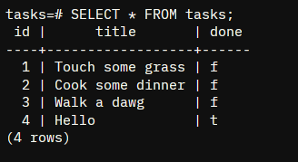

# CRUD EXPRESS
A to-do list that manage data using Postgres + Docker. It involves the creation, deletion, filtering, update and getting the task status/statistics. Check endpoint `/docs` to read all the request of this API using `swagger-ui-express`.

## Note to the Evaluator
I compile all of my tasks in this repository, you can check each history through its designated branches named after
the task week, act number, and my current course : `W1A1BE`.

## How to 
* install dependencies using : `npm install`
* run using : `npm run dev`
* to insert mock data on table (no need to run this if you used docker-compose): `npm run seed`
* (make sure to install docker-compose first via your package manager if needed) Compose up the container using : `docker-compose up`
* To see if the docker is running and its name used : `docker ps`
* To enter the container's envrinment use : `docker exec -it <container_name> sh or bash`
* Setting up the environment check the variables [here](./.env.example)

## Table of all Enpoints

| Method | Endpoint  | Description                                                                                                         |
|--------|-----------|---------------------------------------------------------------------------------------------------------------------|
| GET    | /         | Details about the API                                                                                               |
| GET    | /health   | Is the API successfully running?                                                                                    |
| GET    | /task/:id | Find task via ID                                                                                                    |
| GET    | /task     | get all the task                             |
| POST   | /task     | Create a task, given a .json of `{title, done}`<br>Auto incremented ID based of the total length <br>of the dataset |
| PUT    | /task/:id | Update a record given the parameter id. <br>pass a .json with `title` and/or `done` status.                         |
| DELETE | /task/:id | Delete a task given the id }`                                                         |

## TRY IT!
* Using curl : `curl -i -X POST http://localhost:3000/tasks -H "Content-Type: application/json" -d '{"title":"Buy milk"}'`

## Swagger UI
End point `/docs` <br>


## Postgres
### Test it
To test the database using Postgres, you can run these command on your respective engine viewer.
* `SELECT * FROM tasks;` : This displays the table consist of all tasks
* `DROP TABLE tasks;` : This drops the table named tasks, you can create a table using `npm run seed` which also creates mock data. You can also check the [schema.sql](src/schema/task.schema.sql) to create a table
* `DELETE FROM tasks;`: Delete all record inside the table
<br>
<br>
if you are running this on psql, you can connect to the the database by running this inside the project:
<br>

```
psql -U [username] -d tasks
```

<br>
Then run the commands above to try the database!

### Sample
Sample Table from with the use of psql CLI 
<br>

`SELECT * FROM this tasks;` 

<br>
    

